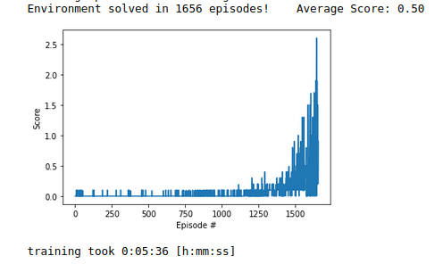
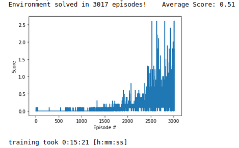

# Udacity's multi-agent tennis training report

## Algorithm
This projects implements the popular Multi-Agent Actor-Critic algorithm (_MADDPG_) based on this [paper](https://papers.nips.cc/paper/2017/file/68a9750337a418a86fe06c1991a1d64c-Paper.pdf).
The algorithm is an extension to the single-agent _DDPG_ algorithm for the continues space domain problems. 
The code for this MADDPG implementation is based on the multi-agent physical deception lab exercise of Udacity's deep reinforcement learning nanodegree.

## Hyper-parameters

| Hyper-parameter name | Value   | Detailed meaning                       |
| :---:                |:----:   | :---:                                  |
| batch-size     | 512      | Number of samples trained in each step |
| τ               | 0.1    | Soft update for target network weights |
| update_frequency     | 5       | Update frequency for target network    |
| γ             | 0.99    | Discount factor                        |
| Replay buffer size   | 1e5     | Capacity of the replay buffer          |
| α_actor	             | 1e-4    | Actor network learning rate   |
| α_critic	             | 3e-4    | Actor network learning rate   |
| hidden_knodes           |[128, 64]| Actor and critic network hidden layer knodes |
| critic_weight_decay     | 0.0   | Decay rate for critic network                 |
| μ_noise          | 0.0  | UO noise mean   |
| σ_noise	             | 0.2    | UO noise variance   |
| τ_noise	             | 0.15    | UO noise theta parameter   |
| β	             | 0.4   | Replay memory training parameter   |
| β_decay	             | 1e4    | Replay memory decay parameter   |
## Results

The problem is solved (average reward > 0.5) in 1656 episodes and 5 min and 36 seconds. A plot of the training curve is shown below

below is an example video of a trained agent

## Future Improvements

The choosen training algorithm showed instability issued from time to time. 
The convergence speed to the desired performance was varied every run. 
A possible cause could be the high soft_update hyperparameter (τ) but decreasing this value resulted on some runs not training at all!

Some improvements that can be explored for the future are a prioritized replay buffer or adding parameter noise for better exploration.
Also, training time per episode take longer as training progresses because episodes are not terminated early on. 

An example of the training curve for a slower run is shown below. 

